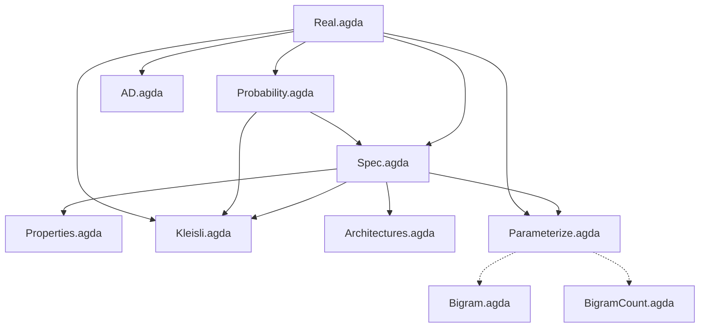

# Denotational LLM

Conal Elliott [showed](http://conal.net/papers/essence-of-ad/) that if you start with the mathematical specification of differentiation and work out the algebra, AD algorithms *fall out* — reverse-mode AD is just "use continuations as your representation of linear maps." The algebra revealed why it works and suggested new variations.

**Can we do the same thing for text prediction?** Start with a precise specification of "getting better at predicting the next character," find the algebraic structure, and see what falls out?

This repo is that attempt, formalized in Agda.

## The analogy

| AD (Elliott 2018) | Text Prediction (this repo) |
|---|---|
| Differentiable function f : A → B | Predictor p : History → Dist(Char) |
| Smooth functions form a **category** | Predictors form a **Kleisli category** |
| Derivative is a **functor** to linear maps | Score is a **functor** to (ℝ, +) |
| Chain rule: D(f∘g) = D(f)∘D(g) | Score decomposition: score(xs++ys) = score(xs) + score(h++xs, ys) |
| Reps of linear maps → AD algorithms | Reps of Kleisli morphisms → architectures |
| Forward-mode, reverse-mode, etc. | Bigram, RNN, Attention, etc. |

The "chain rule" analog is score decomposition: score additively splits over corpus concatenation, with the history shifting — exactly like how AD's chain rule evaluates D(f) at g(x), not at x.

## Status

We've built the algebraic framework and proven the key structural theorems. Different representations of the Kleisli morphism `List Char → Char → ℝ` yield different architectures (bigram, n-gram, RNN, attention), each correct by construction. Gradient ascent on any parameterized family is a valid improvement strategy, derived from the specification.

**What's working:** The specification, categorical structure, architecture hierarchy, AD, parameterized improvement, and executable bigrams that match [Karpathy's makemore](https://github.com/karpathy/makemore) numbers.

**The open question:** In Conal's work, new algorithms genuinely *fell out* of the algebra — reverse-mode AD via continuations was a surprise. We haven't gotten there yet for text prediction. We have an elegant unified explanation of *why* existing architectures work, but we haven't yet derived a novel architecture or optimization that nobody knew about. That's the goal — uncovering new representations of the Kleisli morphism that are interesting architectures, or new optimization strategies suggested by the algebraic structure.

## Module dependencies



Solid arrows are `open import` dependencies. Dotted arrows indicate that the executable modules follow the structure proven in the spec modules but use `Float` instead of postulated `ℝ`.

## Files

| File | Description |
|------|-------------|
| `Real.agda` | Postulated ordered field ℝ with log/exp axioms |
| `Probability.agda` | Distribution type, softmax specification, uniform distribution |
| `Spec.agda` | Predictor type, score function, improvement relation, score decomposition |
| `Properties.agda` | Score monotonicity, convex combinations, Jensen's inequality |
| `Kleisli.agda` | Kleisli category structure; score as indexed monoid homomorphism |
| `Architectures.agda` | Bigram, n-gram, RNN, Attention as representation choices with embeddings |
| `AD.agda` | Forward-mode automatic differentiation via dual numbers |
| `Parameterize.agda` | Parameter families, gradient ascent validity |
| `Bigram.agda` | Executable bigram trained by numerical gradient descent (10 names) |
| `BigramCount.agda` | Executable count-based bigram via MLE (32k names from Karpathy's makemore) |
| `names.txt` | 32,032 names dataset from [Karpathy's makemore](https://github.com/karpathy/makemore) |

## Proven theorems

| Theorem | Module | Statement |
|---------|--------|-----------|
| `atLeastAsGood-refl` | Spec | Improvement relation is reflexive |
| `atLeastAsGood-trans` | Spec | Improvement relation is transitive |
| `score-split` | Spec | Score decomposes over corpus concatenation (our "chain rule") |
| `score-is-homomorphism` | Kleisli | Score is an indexed monoid homomorphism (unit + composition) |
| `score-left-identity` | Kleisli | Categorical left identity |
| `score-right-identity` | Kleisli | Categorical right identity |
| `score-assoc` | Kleisli | Categorical associativity |
| `scoreFrom-mono` | Properties | Pointwise higher log-prob implies higher total score |
| `pointwise→atLeast` | Properties | Pointwise dominance implies improvement |
| `mix-with-better` | Properties | Mixing with a better predictor improves things |
| `arch-score-split` | Architectures | Score decomposition transfers to any architecture |
| `bigram-markov` | Architectures | Bigram depends only on last character |
| `param-improvement` | Parameterize | Better parameters imply better predictor |
| `gradient-improves` | Parameterize | Gradient ascent step produces a better predictor |
| `+ᴰ-val-correct`, `*ᴰ-val-correct` | AD | Dual arithmetic preserves values |
| `+ᴰ-der-correct` | AD | Dual addition computes correct derivative |

## What's postulated

| Postulate | Why |
|-----------|-----|
| All of `Real.agda` | ℝ as an ordered field with log/exp — standard math axioms |
| `gradient-ascent-lemma` | Requires formalizing multivariable calculus |
| `jensen-log` | Requires formalizing concavity of log |
| `log-prob-is-score` | Requires threading positivity proofs (straightforward but tedious) |
| `attn-subsumes-rnn` | Constructive but needs auxiliary lemmas about `enumerate` |

## Running it

Requires [Agda](https://wiki.portal.chalmers.se/agda/Main/Download) with the [standard library](https://github.com/agda/agda-stdlib) (v2.3).

```bash
# Type-check all proof modules
agda Spec.agda && agda Properties.agda && agda Kleisli.agda && \
agda Architectures.agda && agda AD.agda && agda Parameterize.agda

# Compile and run the small bigram (gradient descent on 10 names)
agda --compile Bigram.agda && ./Bigram

# Compile and run the count-based bigram (MLE on 32k names)
agda --compile BigramCount.agda && ./BigramCount
```

## References

- Conal Elliott, [*The Simple Essence of Automatic Differentiation*](http://conal.net/papers/essence-of-ad/) (2018) — the methodological template: differentiation as a functor, representations of linear maps give AD algorithms
- Conal Elliott, [*Compiling to Categories*](http://conal.net/papers/compiling-to-categories/) (2017) — the general methodology: define meaning, require homomorphism, solve for implementation
- Andrej Karpathy, [makemore](https://github.com/karpathy/makemore) — the character-level language model series; our bigrams match his performance numbers
