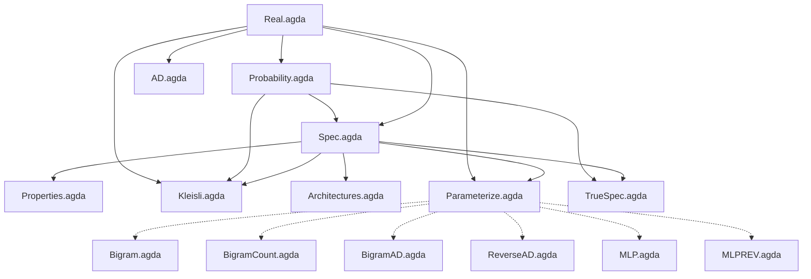

# Denotational LLM

Conal Elliott [showed](http://conal.net/papers/essence-of-ad/) that if you start with the mathematical specification of differentiation and work out the algebra, AD algorithms *fall out* — reverse-mode AD is just "use continuations as your representation of linear maps." The algebra revealed why it works and suggested new variations.

**Can we do the same thing for text prediction?** Start with a precise specification of "getting better at predicting the next character," find the algebraic structure, and see what falls out?

This repo is that attempt, formalized in Agda. We use Karpathy's [makemore](https://github.com/karpathy/makemore) as our concrete target — the same character-level name generation task, progressing from bigrams toward GPT-level architectures — but derived from algebraic specification rather than built up from neural network primitives.

## The approach

Following Conal's [methodology](http://conal.net/papers/type-class-morphisms/): define the meaning precisely, require a homomorphism, and solve for the implementation. Concretely:

1. **Specify** what "good predictor" means: `Predictor = List Char → Char → ℝ`, scored by expected log-probability under the true text distribution (`TrueSpec.agda`). The corpus-based score (`Spec.agda`) is the empirical estimator.
2. **Find algebraic structure**: score is a monoid homomorphism from (List Char, ++) to (ℝ, +) — it decomposes over corpus concatenation
3. **Classify representations**: restricting how the predictor uses history yields known architectures (bigram, n-gram, RNN, attention) as a strict hierarchy
4. **Optimize**: gradient ascent on any parameterized family is a valid improvement strategy

## Status

**What's working:** Two-layer specification (true score over distributions + empirical score on corpora), score decomposition, Kleisli category structure, architecture hierarchy, forward-mode *and reverse-mode* AD, parameterized improvement, executable bigrams matching Karpathy's NLL = 2.454 on 32k names, AD-trained bigram with exact dual-number gradients, reverse-mode AD via continuations (one backward pass for all 729 parameters), MLP with reverse-mode AD training (explicit backprop, 209x faster gradients), and an executable MLP (context window + embeddings + hidden layer + softmax).

**What's honest:** Most of this verifies known things rather than deriving new ones. Score decomposition is "log of a product = sum of logs." The reverse-mode AD implementation demonstrates Conal's core pattern (continuations as representation of linear maps) and matches forward-mode output exactly — but this is reproducing Conal's known result, not a new one. The architecture classification explains *why* existing architectures work, but we haven't yet derived anything from the algebra that nobody knew. That's the goal.

**What's resolved:** The adequacy problem. `TrueSpec.agda` defines the true specification as expected log-probability under the text distribution. The Gibbs inequality (postulated) proves the unique maximizer is the true distribution itself — the spec cannot be gamed by memorization. The corpus-based score in `Spec.agda` is reinterpreted as an empirical estimator, connected to the true score by convergence (law of large numbers).

## Next steps

1. **Scale MLPREV training** — MLPREV.agda successfully trains an MLP with reverse-mode AD using explicit backprop (closure-based approach blew up in Agda/Haskell; explicit works). Next: more training steps, full 32k names, bigger hidden layer to push performance closer to Karpathy's targets.
2. **Derive something new** — find a representation of `List Char → Char → ℝ` that the algebra *forces*, or an optimization insight that falls out of the spec
3. **Close postulate gaps** — `gradient-ascent-lemma` postulates the punchline of `gradient-improves`; narrowing what's assumed would strengthen the formalization

## Module dependencies



Solid arrows are `open import` dependencies. Dotted arrows indicate that the executable modules follow the structure proven in the spec modules but use `Float` instead of postulated `ℝ`.

## Files

| File | Description |
|------|-------------|
| `Real.agda` | Postulated ordered field ℝ with log/exp axioms |
| `Probability.agda` | Distribution type, softmax specification, uniform distribution |
| `Spec.agda` | Predictor type, empirical score, improvement relation, score decomposition |
| `TrueSpec.agda` | True specification: expected score under distribution, Gibbs inequality (adequacy) |
| `Properties.agda` | Score monotonicity, convex combinations, Jensen's inequality |
| `Kleisli.agda` | Kleisli category structure; score as indexed monoid homomorphism |
| `Architectures.agda` | Bigram, n-gram, RNN, Attention as representation choices with embeddings |
| `AD.agda` | Forward-mode and reverse-mode AD via dual numbers and continuations |
| `Parameterize.agda` | Parameter families, gradient ascent validity |
| `Bigram.agda` | Executable bigram trained by numerical gradient descent (10 names) |
| `BigramCount.agda` | Executable count-based bigram via MLE (32k names, matches Karpathy's NLL = 2.454) |
| `BigramAD.agda` | Executable bigram trained with forward-mode AD dual numbers (exact gradients) |
| `ReverseAD.agda` | Executable reverse-mode AD bigram: one backward pass for full gradient (matches forward-mode) |
| `MLP.agda` | Executable MLP: context window + embeddings + hidden layer + softmax (makemore part 2) |
| `MLPREV.agda` | Executable MLP with reverse-mode AD (explicit backprop, 209x faster gradients) |
| `names.txt` | 32,032 names dataset from [Karpathy's makemore](https://github.com/karpathy/makemore) |

## Proven theorems

| Theorem | Module | Statement |
|---------|--------|-----------|
| `trueAtLeast-refl` | TrueSpec | True improvement relation is reflexive |
| `trueAtLeast-trans` | TrueSpec | True improvement relation is transitive |
| `trueBetter-trans` | TrueSpec | Strict true improvement is transitive |
| `atLeastAsGood-refl` | Spec | Empirical improvement relation is reflexive |
| `atLeastAsGood-trans` | Spec | Empirical improvement relation is transitive |
| `score-split` | Spec | Empirical score decomposes over corpus concatenation |
| `score-is-homomorphism` | Kleisli | Score is an indexed monoid homomorphism (unit + composition) |
| `score-left-identity` | Kleisli | Categorical left identity |
| `score-right-identity` | Kleisli | Categorical right identity |
| `score-assoc` | Kleisli | Categorical associativity |
| `scoreFrom-mono` | Properties | Pointwise higher log-prob implies higher total score |
| `pointwise→atLeast` | Properties | Pointwise dominance implies improvement |
| `mix-with-better` | Properties | Mixing with a better predictor improves things |
| `arch-score-split` | Architectures | Score decomposition transfers to any architecture |
| `bigram-markov` | Architectures | Bigram depends only on last character |
| `param-improvement` | Parameterize | Better parameters imply better predictor |
| `gradient-improves` | Parameterize | Gradient ascent produces a better predictor (relies on postulated lemma) |
| `+ᴰ-val-correct`, `*ᴰ-val-correct` | AD | Dual arithmetic preserves values |
| `+ᴰ-der-correct` | AD | Dual addition computes correct derivative |
| `+R-back`, `*R-back` | AD | Reverse-mode backpropagators are correct |
| `logRv-back`, `expRv-back` | AD | Reverse-mode log/exp backpropagators correct |
| `rev-gradient-improves` | AD | Reverse-mode gradient ascent produces better predictor |

## What's postulated

| Postulate | Why | Severity |
|-----------|-----|----------|
| All of `Real.agda` | ℝ as an ordered field with log/exp — standard math axioms | Low — standard |
| `gradient-ascent-lemma` | Requires formalizing multivariable calculus | High — this postulates the punchline of `gradient-improves` |
| `jensen-log` | Requires formalizing concavity of log | Medium |
| `log-prob-is-score` | Requires threading positivity proofs (tedious) | Low |
| `attn-subsumes-rnn` | Needs auxiliary lemmas about `enumerate` | Low |
| `trueScore` | Abstract expected log-prob under distribution (requires measure theory to define) | Medium — the right abstraction |
| `gibbs`, `gibbs-strict` | KL divergence non-negativity; the key adequacy result | Medium — standard information theory |
| `empirical-convergence` | Law of large numbers connecting empirical to true score | Medium — requires measure theory |
| `reverse-equals-forward` | Forward-mode and reverse-mode compute same derivative | Low — standard AD result |
| `rev-gradient-correct` | Reverse gradient equals true gradient | Low — follows from above |

## Running it

Requires [Agda](https://wiki.portal.chalmers.se/agda/Main/Download) with the [standard library](https://github.com/agda/agda-stdlib) (v2.3).

```bash
# Type-check all proof modules
agda Spec.agda && agda TrueSpec.agda && agda Properties.agda && \
agda Kleisli.agda && agda Architectures.agda && agda AD.agda && \
agda Parameterize.agda

# Compile and run the small bigram (gradient descent on 10 names)
agda --compile Bigram.agda && ./Bigram

# Compile and run the count-based bigram (MLE on 32k names)
agda --compile BigramCount.agda && ./BigramCount

# Compile and run the AD-trained bigram (forward-mode dual numbers)
agda --compile BigramAD.agda && ./BigramAD

# Compile and run the reverse-mode AD bigram (continuations)
agda --compile ReverseAD.agda && ./ReverseAD

# Compile and run the MLP (context window + embeddings + hidden layer)
agda --compile MLP.agda && ./MLP

# Compile and run the MLP with reverse-mode AD training (explicit backprop)
agda --compile MLPREV.agda && ./MLPREV
```

## References

- Conal Elliott, [*The Simple Essence of Automatic Differentiation*](http://conal.net/papers/essence-of-ad/) (2018) — the methodological template: differentiation as a functor, representations of linear maps give AD algorithms
- Conal Elliott, [*Compiling to Categories*](http://conal.net/papers/compiling-to-categories/) (2017) — the general methodology: define meaning, require homomorphism, solve for implementation
- Andrej Karpathy, [makemore](https://github.com/karpathy/makemore) — the character-level name generation series (bigram → MLP → RNN → GPT); our concrete target task and performance benchmark
