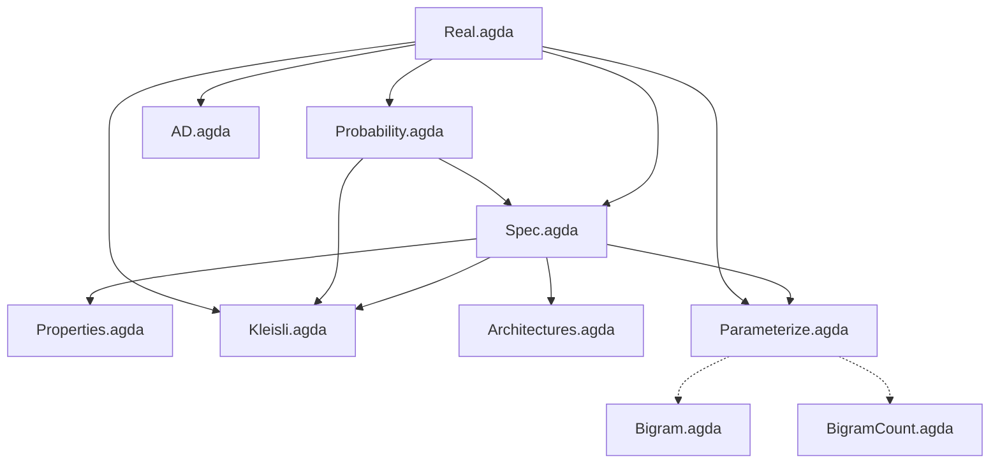

# Denotational LLM

An Agda formalization of text prediction, following [Conal Elliott's methodology](http://conal.net/papers/compiling-to-categories/): start with a mathematical specification, identify the algebraic structure, and derive implementations that are correct by construction.

The specification says what it means for one predictor to be better than another (higher log-likelihood). Score decomposition over corpus concatenation gives us a "chain rule" analog. Different representations of the predictor type yield different architectures (bigram, RNN, attention), each inheriting all proven properties automatically.

## Module dependencies



Solid arrows are `open import` dependencies. Dotted arrows indicate that the executable modules follow the structure proven in the spec modules but use `Float` instead of postulated `ℝ`.

## Files

| File | Description |
|------|-------------|
| `Real.agda` | Postulated ordered field ℝ with log/exp axioms |
| `Probability.agda` | Distribution type, softmax specification, uniform distribution |
| `Spec.agda` | Predictor type, score function, improvement relation, score decomposition |
| `Properties.agda` | Score monotonicity, convex combinations, Jensen's inequality |
| `Kleisli.agda` | Kleisli category structure; score as indexed monoid homomorphism |
| `Architectures.agda` | Bigram, n-gram, RNN, Attention as representation choices with embeddings |
| `AD.agda` | Forward-mode automatic differentiation via dual numbers |
| `Parameterize.agda` | Parameter families, gradient ascent validity |
| `Bigram.agda` | Executable bigram trained by numerical gradient descent (10 names) |
| `BigramCount.agda` | Executable count-based bigram via MLE (32k names from Karpathy's makemore) |
| `names.txt` | 32,032 names dataset from [Karpathy's makemore](https://github.com/karpathy/makemore) |

## Proven theorems

| Theorem | Module | Statement |
|---------|--------|-----------|
| `atLeastAsGood-refl` | Spec | Improvement relation is reflexive |
| `atLeastAsGood-trans` | Spec | Improvement relation is transitive |
| `score-split` | Spec | Score decomposes over corpus concatenation (our "chain rule") |
| `score-is-homomorphism` | Kleisli | Score is an indexed monoid homomorphism (unit + composition) |
| `score-left-identity` | Kleisli | Categorical left identity |
| `score-right-identity` | Kleisli | Categorical right identity |
| `score-assoc` | Kleisli | Categorical associativity |
| `scoreFrom-mono` | Properties | Pointwise higher log-prob implies higher total score |
| `pointwise→atLeast` | Properties | Pointwise dominance implies improvement |
| `mix-with-better` | Properties | Mixing with a better predictor improves things |
| `arch-score-split` | Architectures | Score decomposition transfers to any architecture |
| `bigram-markov` | Architectures | Bigram depends only on last character |
| `param-improvement` | Parameterize | Better parameters imply better predictor |
| `gradient-improves` | Parameterize | Gradient ascent step produces a better predictor |
| `+ᴰ-val-correct`, `*ᴰ-val-correct` | AD | Dual arithmetic preserves values |
| `+ᴰ-der-correct` | AD | Dual addition computes correct derivative |

## What's postulated

| Postulate | Why |
|-----------|-----|
| All of `Real.agda` | ℝ as an ordered field with log/exp — standard math axioms |
| `gradient-ascent-lemma` | Requires formalizing multivariable calculus |
| `jensen-log` | Requires formalizing concavity of log |
| `log-prob-is-score` | Requires threading positivity proofs (straightforward but tedious) |
| `attn-subsumes-rnn` | Constructive but needs auxiliary lemmas about `enumerate` |

## Running it

Requires [Agda](https://wiki.portal.chalmers.se/agda/Main/Download) with the [standard library](https://github.com/agda/agda-stdlib) (v2.3).

```bash
# Type-check all proof modules
agda Spec.agda && agda Properties.agda && agda Kleisli.agda && \
agda Architectures.agda && agda AD.agda && agda Parameterize.agda

# Compile and run the small bigram (gradient descent on 10 names)
agda --compile Bigram.agda && ./Bigram

# Compile and run the count-based bigram (MLE on 32k names)
agda --compile BigramCount.agda && ./BigramCount
```

## References

- Conal Elliott, [*The Simple Essence of Automatic Differentiation*](http://conal.net/papers/essence-of-ad/) (2018) — the methodological template
- Conal Elliott, [*Compiling to Categories*](http://conal.net/papers/compiling-to-categories/) (2017)
- Andrej Karpathy, [makemore](https://github.com/karpathy/makemore) — the character-level language model series this formalizes
