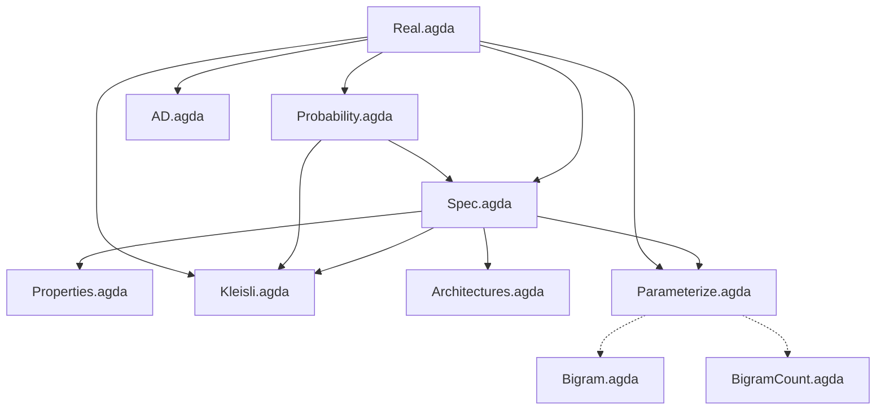

# Denotational LLM

Conal Elliott [showed](http://conal.net/papers/essence-of-ad/) that if you start with the mathematical specification of differentiation and work out the algebra, AD algorithms *fall out* — reverse-mode AD is just "use continuations as your representation of linear maps." The algebra revealed why it works and suggested new variations.

**Can we do the same thing for text prediction?** Start with a precise specification of "getting better at predicting the next character," find the algebraic structure, and see what falls out?

This repo is that attempt, formalized in Agda. We use Karpathy's [makemore](https://github.com/karpathy/makemore) as our concrete target — the same character-level name generation task, progressing from bigrams toward GPT-level architectures — but derived from algebraic specification rather than built up from neural network primitives.

## The approach

Following Conal's [methodology](http://conal.net/papers/type-class-morphisms/): define the meaning precisely, require a homomorphism, and solve for the implementation. Concretely:

1. **Specify** what "good predictor" means: `Predictor = List Char → Char → ℝ`, scored by log-likelihood
2. **Find algebraic structure**: score is a monoid homomorphism from (List Char, ++) to (ℝ, +) — it decomposes over corpus concatenation
3. **Classify representations**: restricting how the predictor uses history yields known architectures (bigram, n-gram, RNN, attention) as a strict hierarchy
4. **Optimize**: gradient ascent on any parameterized family is a valid improvement strategy

## Status

**What's working:** The specification, score decomposition, Kleisli category structure, architecture hierarchy, forward-mode AD, parameterized improvement, and executable bigrams matching Karpathy's makemore numbers.

**What's honest:** Most of this verifies known things rather than deriving new ones. Score decomposition is "log of a product = sum of logs." The architecture classification explains *why* existing architectures work, but unlike Conal's AD work — where reverse-mode via continuations was a genuine surprise — we haven't yet derived anything from the algebra that nobody knew. That's the goal.

**What's unresolved:** The specification may not be *adequate* (in Conal's sense — can it be gamed?). A predictor that memorizes the training corpus scores perfectly. Addressing this is probably more important than building more computation on top of a possibly-wrong spec.

## Next steps

1. **Fix the spec** — the adequacy problem: our spec rewards memorization. How do we express "this predictor generalizes" in the type system? (Compression? Complexity bounds? Something the algebra suggests?)
2. **Scale BigramCount to 32k names** — currently uses 50 hardcoded names; read from `names.txt` and match Karpathy's NLL = 2.454 benchmark
3. **Executable MLP** — Karpathy's makemore part 2: fixed context window, character embeddings, hidden layer
4. **Wire AD into training** — replace numerical perturbation with exact forward-mode gradients; then reverse-mode AD for larger models
5. **Derive something new** — find a representation of `List Char → Char → ℝ` that the algebra *forces*, or an optimization insight that falls out of the spec

## Module dependencies



Solid arrows are `open import` dependencies. Dotted arrows indicate that the executable modules follow the structure proven in the spec modules but use `Float` instead of postulated `ℝ`.

## Files

| File | Description |
|------|-------------|
| `Real.agda` | Postulated ordered field ℝ with log/exp axioms |
| `Probability.agda` | Distribution type, softmax specification, uniform distribution |
| `Spec.agda` | Predictor type, score function, improvement relation, score decomposition |
| `Properties.agda` | Score monotonicity, convex combinations, Jensen's inequality |
| `Kleisli.agda` | Kleisli category structure; score as indexed monoid homomorphism |
| `Architectures.agda` | Bigram, n-gram, RNN, Attention as representation choices with embeddings |
| `AD.agda` | Forward-mode automatic differentiation via dual numbers |
| `Parameterize.agda` | Parameter families, gradient ascent validity |
| `Bigram.agda` | Executable bigram trained by numerical gradient descent (10 names) |
| `BigramCount.agda` | Executable count-based bigram via MLE (50 names, needs scaling) |
| `names.txt` | 32,032 names dataset from [Karpathy's makemore](https://github.com/karpathy/makemore) |

## Proven theorems

| Theorem | Module | Statement |
|---------|--------|-----------|
| `atLeastAsGood-refl` | Spec | Improvement relation is reflexive |
| `atLeastAsGood-trans` | Spec | Improvement relation is transitive |
| `score-split` | Spec | Score decomposes over corpus concatenation |
| `score-is-homomorphism` | Kleisli | Score is an indexed monoid homomorphism (unit + composition) |
| `score-left-identity` | Kleisli | Categorical left identity |
| `score-right-identity` | Kleisli | Categorical right identity |
| `score-assoc` | Kleisli | Categorical associativity |
| `scoreFrom-mono` | Properties | Pointwise higher log-prob implies higher total score |
| `pointwise→atLeast` | Properties | Pointwise dominance implies improvement |
| `mix-with-better` | Properties | Mixing with a better predictor improves things |
| `arch-score-split` | Architectures | Score decomposition transfers to any architecture |
| `bigram-markov` | Architectures | Bigram depends only on last character |
| `param-improvement` | Parameterize | Better parameters imply better predictor |
| `gradient-improves` | Parameterize | Gradient ascent produces a better predictor (relies on postulated lemma) |
| `+ᴰ-val-correct`, `*ᴰ-val-correct` | AD | Dual arithmetic preserves values |
| `+ᴰ-der-correct` | AD | Dual addition computes correct derivative |

## What's postulated

| Postulate | Why | Severity |
|-----------|-----|----------|
| All of `Real.agda` | ℝ as an ordered field with log/exp — standard math axioms | Low — standard |
| `gradient-ascent-lemma` | Requires formalizing multivariable calculus | High — this postulates the punchline of `gradient-improves` |
| `jensen-log` | Requires formalizing concavity of log | Medium |
| `log-prob-is-score` | Requires threading positivity proofs (tedious) | Low |
| `attn-subsumes-rnn` | Needs auxiliary lemmas about `enumerate` | Low |

## Running it

Requires [Agda](https://wiki.portal.chalmers.se/agda/Main/Download) with the [standard library](https://github.com/agda/agda-stdlib) (v2.3).

```bash
# Type-check all proof modules
agda Spec.agda && agda Properties.agda && agda Kleisli.agda && \
agda Architectures.agda && agda AD.agda && agda Parameterize.agda

# Compile and run the small bigram (gradient descent on 10 names)
agda --compile Bigram.agda && ./Bigram

# Compile and run the count-based bigram (MLE on 50 names)
agda --compile BigramCount.agda && ./BigramCount
```

## References

- Conal Elliott, [*The Simple Essence of Automatic Differentiation*](http://conal.net/papers/essence-of-ad/) (2018) — the methodological template: differentiation as a functor, representations of linear maps give AD algorithms
- Conal Elliott, [*Compiling to Categories*](http://conal.net/papers/compiling-to-categories/) (2017) — the general methodology: define meaning, require homomorphism, solve for implementation
- Andrej Karpathy, [makemore](https://github.com/karpathy/makemore) — the character-level name generation series (bigram → MLP → RNN → GPT); our concrete target task and performance benchmark
